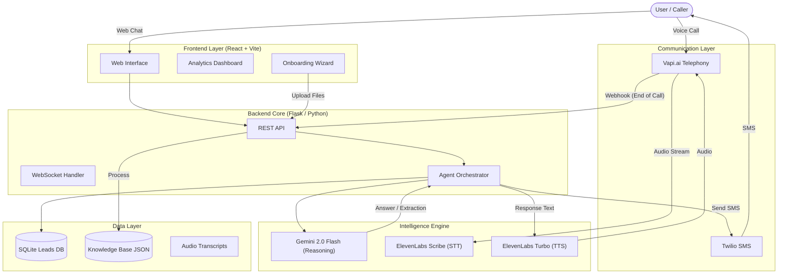

# Vani.ai System Architecture

## Component Description

1.  **Frontend**: Built with **React** and **Vite**, focusing on a premium, responsive UI. It handles business registration, live chat testing, and provides a real-time analytics dashboard.
2.  **Backend**: Powered by **Flask** (Python). It serves as the central controller, managing webhooks from telephony providers and coordinating AI services.
3.  **Telephony**:
    *   **Vapi.ai**: Manages the phone line, voice activity detection, and latency optimization.
    *   **Twilio**: Handles programmatic SMS dispatch for post-call engagement.
4.  **Intelligence**:
    *   **Gemini 2.0 Flash**: The brain. Handles conversational logic, intent understanding, and data extraction (Lead Name, Phone, Summary).
    *   **ElevenLabs Scribe/Turbo**: Full-stack voice AI (Speech-to-Text and Text-to-Speech) for seamless, low-latency interaction.
5.  **Data**: A lightweight **SQLite** database tracks conversation history and extracted leads, enabling persistent memory (recognizing repeat callers).
